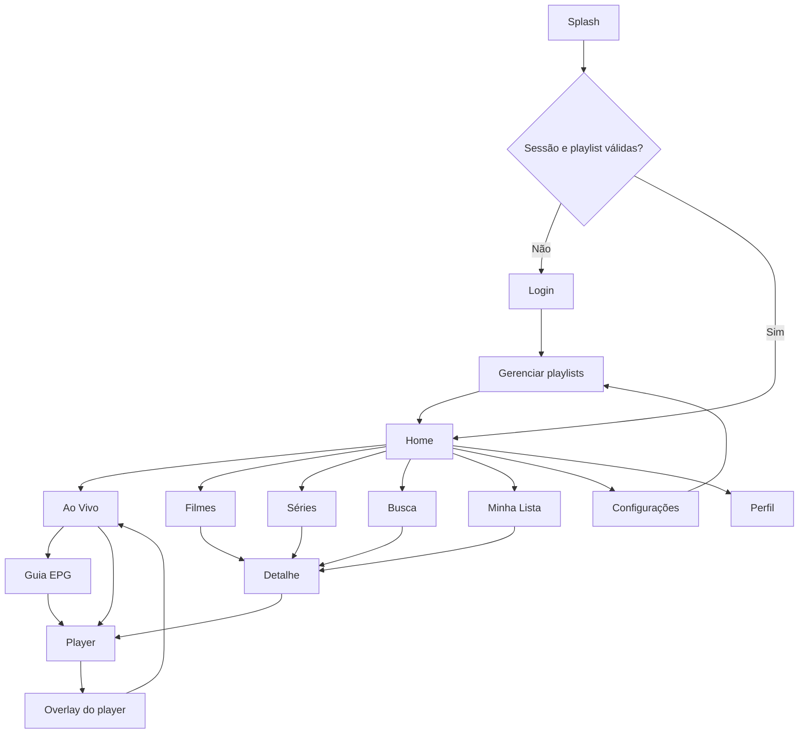
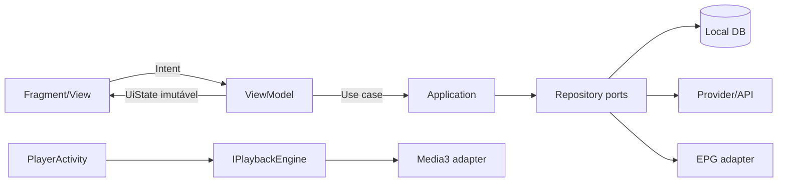

# Hiptv — Product UX Blueprint

**Status:** proposta para produção  
**Plataformas:** Android TV, Google TV, Fire TV, TV Box, Android Mobile e futura UI webOS  
**Baseline de design TV:** 1920 × 1080 px, área segura de 48 dp  
**Direção:** entretenimento premium, rápido para zapping, sem reproduzir a identidade de outros produtos

## 1. Diagnóstico da solução atual

O Hiptv já possui fundamentos técnicos úteis, mas a apresentação ainda é um starter:

- `net8.0-android`, Android API 21+, AppCompat, RecyclerView e Media3/ExoPlayer com HLS;
- launcher atual em `BottomNavigationActivity`, com quatro botões e catálogo mock;
- `HomeActivity` alternativa não integrada, baseada em `ListView`;
- `MediaListActivity` linear para todos os tipos de mídia;
- `PlayerActivity` com Media3, fallback legado, hardening básico e favoritos;
- domínio inicial para `Channel`, `Series`, `Episode`, playback, playlist e EPG;
- favoritos em `SharedPreferences`, sem perfil ou sincronização;
- webOS separado em HTML/JavaScript, ainda como demonstração;
- nenhum sistema explícito de foco D-pad, trilha de navegação, skeleton, empty state ou responsividade TV/mobile;
- o Manifest ainda não está pronto para distribuição Android TV: faltam `LEANBACK_LAUNCHER`, banner, declaração de touchscreen opcional e políticas por dispositivo;
- tema atual é apenas preto, branco e vermelho, sem tokens, estados semânticos ou temas alternativos.

A evolução recomendada é incremental: preservar parser, contratos de domínio e Media3; substituir Activities/listas genéricas por uma camada de apresentação MVVM com um shell consistente.

## 2. Posicionamento visual

### Conceito: **Hiptv Signal**

A identidade representa um sinal vivo e organizado: rápida para TV ao vivo, cinematográfica para VOD e calma durante a reprodução. O diferencial não é imitar um catálogo de streaming; é unir **descoberta de conteúdo** e **zapping eficiente** na mesma linguagem.

Princípios:

1. **Conteúdo antes do chrome:** imagens e programação ocupam o palco; navegação recolhe quando não está em uso.
2. **Foco inequívoco:** em TV, sempre existe exatamente um alvo focado e sua próxima direção é previsível.
3. **Live é imediato:** abrir Ao Vivo restaura o último canal; trocar de canal não exige sair do contexto.
4. **Informação progressiva:** primeiro título e ação; detalhes, EPG e opções aparecem sob demanda.
5. **Movimento funcional:** animação explica foco, mudança de contexto e carregamento; nunca atrasa zapping.
6. **Plataformas irmãs:** modelos, tokens e comportamento são comuns; layouts e player são nativos de cada runtime.

## 3. Arquitetura de informação

### Navegação global para TV

Rail lateral recolhido com 72 dp e expandido com 248 dp:

- Home
- Ao Vivo
- Guia
- Filmes
- Séries
- Busca
- Minha Lista
- Configurações
- Perfil no rodapé

`Minha Lista` abre um hub com abas **Favoritos**, **Continuar assistindo** e **Recentes**. Atalhos diretos continuam disponíveis na Home.



### Regras de histórico

- `Back` no player fecha primeiro menus, depois overlay, depois retorna à origem.
- `Back` em uma tela raiz move o foco para o rail; novo `Back` abre confirmação de saída.
- Home preserva linha, item e deslocamento ao retornar de detalhe/player.
- Ao Vivo preserva categoria, canal e posição de scroll.
- Um deep link deve abrir detalhe ou canal após validar perfil e playlist.

## 4. Wireframes e especificação das telas

A legenda `[FOCO]` indica o estado inicial ou alvo principal. Os wireframes representam TV em 16:9; mobile reorganiza regiões, não apenas reduz a tela.

### 4.1 Splash Screen

```text
┌──────────────────────────────────────────────────────────────────────┐
│                                                                      │
│                           HIPTV                                      │
│                       ━━━━━ signal                                   │
│                                                                      │
│                    Sincronizando catálogo...                         │
│                         ● ● ○                                        │
│                                                                      │
└──────────────────────────────────────────────────────────────────────┘
```

- Fundo sólido do tema; marca central com no máximo 180 × 64 dp.
- Android 12+: usar SplashScreen API; anteriores usam tema de launch, sem Activity artificial.
- Exibir progresso somente acima de 600 ms. Após 8 s, mostrar `Tentar novamente` e `Configurar playlist`.
- Pré-carregar sessão, perfil, resumo do catálogo e último canal; não baixar imagens em massa.
- Transição de 220 ms por fade; sem vídeo de abertura.

### 4.2 Login

```text
┌──────────────────────────────────────────────────────────────────────┐
│ HIPTV                                                                │
│                                                                      │
│        Entre para sincronizar                 ┌───────────────────┐  │
│        sua experiência                        │ URL do servidor   │  │
│                                               ├───────────────────┤  │
│        Use apenas um provedor                 │ Usuário           │  │
│        autorizado.                            ├───────────────────┤  │
│                                               │ Senha             │  │
│                                               ├───────────────────┤  │
│                                               │ [FOCO] Entrar     │  │
│                                               │ Usar código       │  │
│                                               └───────────────────┘  │
└──────────────────────────────────────────────────────────────────────┘
```

- Métodos: credenciais Xtream/API autorizada, URL M3U e, futuramente, pareamento por código.
- Teclado abre apenas ao confirmar o campo; D-pad percorre campos verticalmente.
- Nunca registrar senha, token ou URL com credenciais; usar armazenamento seguro.
- Erro permanece junto ao campo e move foco apenas quando o envio falhar.
- Mobile: formulário em uma coluna, ação fixa acima do teclado.

### 4.3 Home

```text
┌──┬───────────────────────────────────────────────────────────────────┐
│⌂ │ 18:42                                            Busca   Perfil   │
│● │                                                                   │
│▣ │  HERO: imagem 16:9 com scrim                                      │
│▤ │  Título do conteúdo                                               │
│▶ │  Metadados • resumo em 2 linhas                                  │
│▥ │  [FOCO ▶ Assistir]  + Minha Lista   Mais informações              │
│⌕ │                                                                   │
│★ │  Continuar assistindo                                      Ver >  │
│⚙ │  [████ 42%]  [████ 18%]  [████ 76%]  [████ 09%]                  │
│  │                                                                   │
│  │  TV ao vivo agora                                                 │
│  │  [canal + EPG] [canal + EPG] [canal + EPG] [canal + EPG]         │
│  │                                                                   │
│  │  Filmes em destaque                                               │
│  │  [poster] [poster] [poster] [poster] [poster] [poster]             │
└──┴───────────────────────────────────────────────────────────────────┘
```

**Ordem das seções:** Hero, Continuar Assistindo, TV ao Vivo, Filmes em Destaque, Séries em Destaque, Lançamentos, Favoritos e Assistidos Recentemente. Ocultar linhas vazias.

**Hierarquia:** hero ocupa 56% da altura inicial, mas deixa 96–120 dp da primeira linha visível. Título até 52 sp, resumo 20 sp, metadados 16 sp. Imagem fica à direita/ao fundo e recebe scrim horizontal, nunca blur dominante.

**D-pad:** início em `Assistir` se houver destaque; `Down` vai ao item semanticamente mais próximo da primeira linha. `Left` na primeira coluna abre o rail. Cada linha mantém seu último foco. `Right` no último item carrega nova página sem bloquear o foco.

**Movimento:** troca de hero só após 8 s sem interação; pausa quando o rail/overlay está aberto. Crossfade de 300 ms. Item focado escala a 1,06 em 140 ms e revela título/progresso sem deslocar a linha.

### 4.4 Live TV

```text
┌──────────────────────────────────────────────────────────────────────┐
│ AO VIVO                     Todos os canais              18:42       │
├──────────────┬──────────────────────────┬────────────────────────────┤
│ CATEGORIAS   │ CANAIS                   │ PREVIEW                    │
│ [FOCO] Todos │  101  News HD      ●LIVE │ ┌────────────────────────┐ │
│ Esportes     │  102  Sports 1     62%   │ │                        │ │
│ Filmes       │  103  Cinema       14%   │ │     canal atual        │ │
│ Notícias     │  104  Kids         87%   │ │                        │ │
│ Infantil     │  105  Music              │ └────────────────────────┘ │
│ Locais       │  106  Open TV            │ News HD • 1080p • Estável │
│ Favoritos    │                          │ [Assistir em tela cheia]  │
├──────────────┴──────────────────────────┴────────────────────────────┤
│ 18:00 Jornal da Noite ━━━━━━━━━━━━━ 18:55 │ 19:00 Previsão do Tempo │
└──────────────────────────────────────────────────────────────────────┘
```

**Medidas TV:** cabeçalho 72 dp; categorias 216 dp; canais 420 dp; preview flexível; rodapé EPG 104 dp. Gap entre painéis 1 dp, sem cartões externos.

**Fluxo:**

1. Entrada restaura categoria/canal e inicia preview silencioso após 450 ms de foco estável.
2. `Up/Down` percorre canais; manter pressionado acelera a lista e suspende previews.
3. `Left/Right` alterna categorias, canais e preview.
4. `OK` no canal abre fullscreen imediatamente; `OK` no preview também.
5. `Play/Pause` controla preview; teclas Channel+/− fazem zapping sem mover a categoria.
6. `Guide` abre EPG no mesmo canal/horário; `Info` expande detalhes do programa.
7. Se o preview falhar, manter lista utilizável e mostrar ação discreta `Tentar novamente`.

Não executar dois players simultâneos: transferir a mesma sessão ou liberar preview antes do fullscreen.

### 4.5 Guia EPG

```text
┌──────────────────────────────────────────────────────────────────────┐
│ GUIA       Hoje  <  18:00  18:30  19:00  19:30  20:00  >   Agora   │
├────────────┬──────────────┬────────────────┬─────────────────────────┤
│ 101 News   │ Jornal local │ [FOCO] Jornal │ Entrevista especial     │
│ 102 Sport  │ Debate       │ Jogo ao vivo ────────────────────────── │
│ 103 Cine   │ Filme A ──────────────────── │ Filme B ─────────────── │
│ 104 Kids   │ Desenho 1    │ Desenho 2      │ Desenho 3              │
│ 105 Music  │ Top hits ───────────────────────────── │ News music     │
├────────────┴─────────────────────────────────────────────────────────┤
│ Jornal • 18:30–19:10 • 40 min                  [Assistir] [Lembrar] │
└──────────────────────────────────────────────────────────────────────┘
```

- Coluna fixa de canal: 208 dp. Slots proporcionais à duração em timeline virtualizada.
- Linha vertical `Agora` em coral; programas passados com opacidade 55%.
- Janela inicial: 2 h passadas + 4 h futuras; paginação temporal em blocos de 3 h.
- `Up/Down` mantém horário aproximado; `Left/Right` navega programas, não pixels.
- `Long OK`: ações assistir, detalhes, favoritar canal e lembrete quando suportado.
- Sem EPG: célula `Programação indisponível`, preservando largura e navegação.

### 4.6 Filmes

```text
┌──┬───────────────────────────────────────────────────────────────────┐
│  │ FILMES        Gêneros   Lançamentos   A-Z             Filtros    │
│  │                                                                   │
│  │ DESTAQUE: título, sinopse e [Assistir] sobre backdrop             │
│  │                                                                   │
│  │ Recomendados para você                                            │
│  │ [FOCO poster] [poster] [poster] [poster] [poster] [poster]         │
│  │  Título • 2026 • 4K                                               │
│  │                                                                   │
│  │ Ação e aventura                                                   │
│  │ [poster] [poster] [poster] [poster] [poster] [poster]              │
└──┴───────────────────────────────────────────────────────────────────┘
```

- Poster TV: 160 × 240 dp (2:3), gap 20 dp, seis visíveis em 1080p com o próximo parcialmente visível.
- Linha: título 28 sp, margem superior 32 dp, inferior 16 dp.
- Foco: escala 1,06; borda interna 3 dp na cor de foco; elevação 12 dp; metadados surgem abaixo em área reservada de 52 dp.
- `OK` abre detalhes; `Play` inicia/recomeça; `Long OK` abre ações rápidas.
- Recomendações devem explicar sinal de origem quando útil: gênero, tendência ou continuação, sem alegar personalização inexistente.

### 4.7 Séries

```text
┌──┬───────────────────────────────────────────────────────────────────┐
│  │ SÉRIES        Em alta   Novos episódios   Gêneros                │
│  │                                                                   │
│  │ Continuar série                                                   │
│  │ [S2:E4 ███ 61%] [S1:E8 ██ 35%] [S4:E1 █████ 88%]                 │
│  │                                                                   │
│  │ Em destaque                                                       │
│  │ [FOCO poster] [poster] [poster] [poster] [poster] [poster]         │
│  │                                                                   │
│  │ Séries completas                                                  │
│  │ [poster] [poster] [poster] [poster] [poster] [poster]              │
└──┴───────────────────────────────────────────────────────────────────┘
```

- Mesmas medidas de Filmes para consistência.
- Card de continuidade mostra `Sx:Ex`, título do episódio e barra de progresso.
- Final com 90% ou menos de 3 min restantes marca episódio concluído e oferece o próximo.
- Autoplay inicia após contagem regressiva de 8 s, cancelável; respeita preferência e não roda em dados móveis quando desabilitado.

### 4.8 Detalhe do Conteúdo

```text
┌──────────────────────────────────────────────────────────────────────┐
│                 BACKDROP 16:9 + SCRIM                                │
│   ┌──────────┐                                                       │
│   │ POSTER   │  TÍTULO                                               │
│   │          │  2026 • 2h 08min • 16 • 4K • Áudio PT • CC           │
│   │          │  Ação, Drama                                          │
│   └──────────┘  Sinopse com no máximo quatro linhas...               │
│                 [FOCO ▶ Assistir] [Continuar 42%] [♡] [Informações]  │
│                                                                      │
│   Temporada 2 ▼                                                      │
│   [E1 thumb + resumo] [E2 thumb + resumo] [E3 thumb + resumo]        │
└──────────────────────────────────────────────────────────────────────┘
```

- Backdrop preenche 62% da tela; poster 216 × 324 dp; conteúdo respeita safe area.
- Filmes exibem recomendações e elenco quando disponível. Séries exibem seletor de temporada e episódios.
- A ação primária é contextual: `Assistir`, `Continuar` ou `Próximo episódio`.
- Qualidade, idioma e legenda só aparecem se confirmados pelo catálogo/player; não inferir pelo nome.
- `Info` abre bottom sheet/painel lateral com ficha completa, sem navegar para outra Activity.

### 4.9 Busca

```text
┌──────────────────────────────────────────────────────────────────────┐
│ BUSCA                                                                │
│ ┌──────────────────────────────────────────────┐  [⌕] [microfone]   │
│ │ [FOCO] futebol_                              │                     │
│ └──────────────────────────────────────────────┘                     │
│ Canais 12   Filmes 8   Séries 3                     Todos | Filtros │
│                                                                      │
│ [canal] [canal] [canal] [canal]                                     │
│ [poster] [poster] [poster] [poster] [poster] [poster]                 │
│                                                                      │
│ Buscas recentes: notícias  ação  infantil                            │
└──────────────────────────────────────────────────────────────────────┘
```

- Busca unificada local em canais, filmes, séries, episódios e EPG; servidor apenas quando necessário.
- Debounce de 250 ms; primeiro resultado em até 500 ms no catálogo local.
- Resultados instantâneos após 2 caracteres, agrupados por tipo, com contagens.
- TV: teclado virtual ocupa até 40% à esquerda quando aberto; resultados continuam visíveis.
- Voz usa o provedor do sistema quando disponível e requer consentimento/permissão apropriada.
- Estado vazio sugere correção e filtros, sem inventar resultados.

### 4.10 Favoritos

```text
┌──┬───────────────────────────────────────────────────────────────────┐
│  │ MINHA LISTA                                                       │
│  │ [FOCO Favoritos]  Continuar assistindo  Recentes                  │
│  │                                                                   │
│  │ Canais                                                            │
│  │ [logo + EPG] [logo + EPG] [logo + EPG] [logo + EPG]              │
│  │                                                                   │
│  │ Filmes e séries                                                   │
│  │ [poster] [poster] [poster] [poster] [poster] [poster]              │
└──┴───────────────────────────────────────────────────────────────────┘
```

- Tipos separados em linhas, sem misturar proporções de cards.
- `Long OK` permite remover, mover para o início ou abrir detalhes.
- Remoção é otimista com snackbar `Desfazer` por 5 s.
- Empty state: ícone, frase curta e ação `Explorar conteúdo`.

### 4.11 Continue Assistindo

```text
┌──┬───────────────────────────────────────────────────────────────────┐
│  │ MINHA LISTA                                                       │
│  │ Favoritos  [FOCO Continuar assistindo]  Recentes                  │
│  │                                                                   │
│  │ [thumb ███████░ 72%]  Filme • faltam 28 min      [Continuar]     │
│  │ [thumb ███░░░░░ 31%]  Série S2:E4 • faltam 35 min                │
│  │ [thumb █████░░░ 58%]  Filme • faltam 51 min                       │
│  │                                                                   │
│  │ [Remover do histórico] aparece via Long OK                        │
└──┴───────────────────────────────────────────────────────────────────┘
```

- Ordenação por interação mais recente; posição atualizada periodicamente e no encerramento.
- Card horizontal 320 × 180 dp, progresso de 4 dp e tempo restante.
- Conteúdo concluído sai desta lista e permanece em Recentes.
- Sincronização entre dispositivos resolve conflito pela posição mais recente com timestamp confiável.

### 4.12 Configurações

```text
┌──┬───────────────────────────────────────────────────────────────────┐
│  │ CONFIGURAÇÕES                                                     │
│  ├──────────────────┬───────────────────────────────────────────────┤
│  │ [FOCO] Reprodução│ Reprodução automática                  [ ON ] │
│  │ Aparência        │ Qualidade preferida                    Auto ▼ │
│  │ Áudio e legendas │ Buffer para TV ao vivo                 Médio │
│  │ EPG              │ Iniciar no último canal                [ ON ] │
│  │ Playlists        │                                               │
│  │ Rede             │                                               │
│  │ Acessibilidade   │                                               │
│  │ Sobre            │                                               │
│  └──────────────────┴───────────────────────────────────────────────┘
└──┴───────────────────────────────────────────────────────────────────┘
```

- Mestre-detalhe na TV; lista simples com subpáginas no mobile.
- Alternadores para binários, menus para opções e stepper para valores; não usar botões genéricos.
- Alterações críticas pedem confirmação: limpar dados, remover playlist e redefinir perfil.
- Diagnóstico de rede mostra fatos úteis sem revelar credenciais.

### 4.13 Perfil

```text
┌──────────────────────────────────────────────────────────────────────┐
│ PERFIL                                                               │
│                                                                      │
│      ( E )   Ederson                                                 │
│              Perfil principal • conteúdo 16+                         │
│                                                                      │
│      [FOCO Editar perfil] [Trocar perfil] [Sair]                     │
│                                                                      │
│      Preferências                                                    │
│      Idioma PT-BR • Áudio PT • Legendas automáticas                  │
└──────────────────────────────────────────────────────────────────────┘
```

- Avatar pode ser cor + inicial ou coleção licenciada; não depender de foto remota.
- PIN parental é digitado em modal protegido e nunca exibido/logado.
- Perfis isolam favoritos, progresso, restrição etária e preferências.
- `Sair` remove sessão, mas pode preservar playlists locais mediante confirmação explícita.

### 4.14 Player Fullscreen

```text
┌──────────────────────────────────────────────────────────────────────┐
│                                                                      │
│                         VÍDEO                                        │
│                                                                      │
│                                                                      │
│                                                                      │
└──────────────────────────────────────────────────────────────────────┘
```

- Vídeo edge-to-edge, orientação landscape, keep-screen-on e immersive mode.
- Overlay oculto após 4 s; `OK`, `Info`, `Up` ou `Down` o abre.
- TV ao vivo: Channel+/− ou `Up/Down` troca canal; VOD: `Left/Right` busca −/+10 s.
- `Back` com overlay fechado retorna à origem; durante erro abre recuperação antes de sair.
- Surface, decoder e listeners são liberados de acordo com lifecycle; áudio focus e HDMI devem ser respeitados.

### 4.15 Player Overlay

```text
┌──────────────────────────────────────────────────────────────────────┐
│  101  NEWS HD                                      18:42   1080p    │
│                                                                      │
│                         VÍDEO                                        │
│                                                                      │
│  Jornal da Noite • 18:00–18:55                                      │
│  ━━━━━━━━━━━━━━━━━━━━━━━━━━━━━●━━━━━━━━  42:18 / AO VIVO             │
│  A seguir: Previsão do Tempo • 18:55                                │
│                                                                      │
│  [⏮ canal] [FOCO ▶/Ⅱ] [■] [canal ⏭] [CC] [áudio] [qual.] [♡] [ⓘ] │
└──────────────────────────────────────────────────────────────────────┘
```

- Scrim superior e inferior, sem caixa central sobre o vídeo.
- Controles de 48 dp dentro de alvos de 64 × 64 dp; foco de 3 dp e scale 1,08.
- Ações: Play/Pause, Stop, canal anterior/próximo, legendas, áudio, qualidade, favorito e informações.
- Qualidade mostra valor real da track selecionada; estado `Auto` fica explícito.
- Menus de áudio/legenda/qualidade abrem painel direito de até 420 dp e mantêm vídeo visível.
- Em VOD, substituir canal anterior/próximo por episódio anterior/próximo e exibir timeline buscável.
- Buffering: spinner após 300 ms; mensagem de rede após 8 s; tentar novamente e diagnóstico após falha.

### 4.16 Gerenciamento de Playlist

```text
┌──┬───────────────────────────────────────────────────────────────────┐
│  │ PLAYLISTS                                      [+ Adicionar]     │
│  │                                                                   │
│  │ [FOCO] Casa IPTV      Ativa   2.430 itens   Atualizada há 12 min │
│  │        Família        Pronta  1.820 itens   Atualizada ontem     │
│  │        Teste local    Erro    Autenticação necessária            │
│  │                                                                   │
│  │ Detalhes: M3U + XMLTV • atualização 6 h • conteúdo autorizado    │
│  │ [Atualizar] [Editar] [EPG] [Tornar ativa] [Remover]              │
└──┴───────────────────────────────────────────────────────────────────┘
```

- Suporta M3U URL/arquivo e provider autorizado; credenciais ficam no Secure Storage.
- Estados: sincronizando, pronta, desatualizada, credencial expirada, URL inválida e sem rede.
- Atualização ocorre em background com troca atômica: catálogo válido anterior permanece disponível.
- Antes de salvar, testar conectividade e apresentar quantidade de canais/VOD/erros.
- Remoção informa impacto em favoritos e progresso; nunca apaga silenciosamente.

## 5. Design System

### 5.1 Paleta e temas

A cor de marca é coral vivo, derivada do vermelho atual, mas o foco remoto usa turquesa para não confundir **marca**, **seleção** e **foco**.

| Token | Dark | AMOLED | Light | Uso |
|---|---|---|---|---|
| `brand.primary` | `#F04444` | `#FF4D4D` | `#C62828` | CTA, ao vivo, marca |
| `brand.secondary` | `#64D8CB` | `#71E6D8` | `#087F73` | foco e sinal ativo |
| `accent.gold` | `#F4C95D` | `#FFD166` | `#8A6500` | premium, aviso não crítico |
| `surface.base` | `#101214` | `#000000` | `#F5F6F7` | fundo |
| `surface.raised` | `#1A1D21` | `#0B0B0B` | `#FFFFFF` | menu, card, painel |
| `surface.overlay` | `#25292E` | `#141414` | `#E8EAED` | overlays e campos |
| `text.primary` | `#F7F8FA` | `#FFFFFF` | `#17191C` | texto principal |
| `text.secondary` | `#B7BDC5` | `#BDBDBD` | `#565D66` | metadados |
| `state.success` | `#4FC18A` | `#57D497` | `#087A49` | sucesso |
| `state.warning` | `#F4C95D` | `#FFD166` | `#805C00` | alerta |
| `state.error` | `#FF6B6B` | `#FF7373` | `#B4232B` | erro |
| `state.info` | `#67A7FF` | `#75B1FF` | `#1459A6` | informação |

Regras:

- scrim de hero: gradiente funcional preto 88% → 42% → 8%, limitado à legibilidade;
- contraste mínimo 4,5:1 para textos e 3:1 para elementos grandes/foco;
- AMOLED usa preto puro apenas em fundo, mantendo superfícies distinguíveis;
- Light reduz sombras e usa bordas para definição; vídeo e posters não mudam.

### 5.2 Tipografia

- **Display e títulos:** Sora SemiBold, licenciada e empacotada localmente.
- **UI, metadados e corpo:** Source Sans 3 Regular/Semibold, licenciada e local.
- **Fallback de baixo custo:** sans-serif do sistema, sem bloquear startup.
- Escala TV: Display 52/60 sp; H1 40/48; H2 28/36; Title 22/28; Body 18/26; Label 16/20; Caption 14/18.
- Mobile: Display 34/40 sp; H1 28/34; H2 22/28; Body 16/24; Label 14/20; Caption 12/16.
- Letter spacing `0`; máximo de duas linhas em cards e quatro em sinopses.

### 5.3 Espaçamento, bordas e sombras

- Grade base: 4 dp. Escala: 4, 8, 12, 16, 20, 24, 32, 40, 48, 64.
- Safe area TV: 48 dp nas quatro bordas; 64 dp em TVs com overscan conhecido.
- Raios: 4 dp campos/menus; 6 dp cards; 8 dp modais. Nada em formato de pílula salvo chips/tags.
- Bordas: 1 dp repouso; 3 dp foco; 2 dp seleção.
- Elevação: 0 fundo; 4 dp controles; 8 dp painel; 12 dp card focado; 20 dp modal.
- Sombras em TV são curtas e neutras; foco nunca depende apenas de sombra.

### 5.4 Estados interativos

| Estado | Tratamento |
|---|---|
| Rest | superfície normal, texto primário/segundário |
| Focus | borda turquesa 3 dp + scale 1,06 + elevação; anúncio acessível |
| Pressed | scale 0,98 por 80 ms e superfície mais clara/escura |
| Selected | marcador coral 4 dp ou check; pode coexistir com foco |
| Disabled | 38% opacidade, sem elevação; não focável salvo explicação necessária |
| Loading | skeleton estável; nunca altera as dimensões finais |
| Error | ícone + mensagem + ação; vermelho não é o único sinal |
| Live | ponto coral + texto `AO VIVO`; animação apenas na entrada |

Foco e seleção são estados diferentes: a categoria selecionada permanece coral enquanto outro item recebe foco turquesa.

### 5.5 Movimento

- foco: 140 ms, easing decelerate;
- troca de tela: 220 ms fade + deslocamento de 12 dp;
- painel/overlay: 180 ms;
- hero: 300 ms crossfade;
- skeleton: shimmer discreto a 1.200 ms, desativado com reduzir movimento;
- nenhuma animação essencial acima de 300 ms;
- TV Box fraca: desativar blur, parallax, vídeo automático no hero e sombras complexas.

### 5.6 Ícones

- Família única: Material Symbols Rounded/Sharp conforme licenciamento e plataforma.
- Tamanho visual 24–28 dp; alvo TV 56–64 dp; alvo touch mínimo 48 dp.
- Ícone + texto para ações ambíguas; apenas ícone para play, pause, volume, busca e favorito quando o contexto for inequívoco.
- Todo ícone possui `contentDescription`/ARIA label e tooltip em long focus quando necessário.

## 6. Componentes reutilizáveis

| Componente | Variantes | Contrato essencial |
|---|---|---|
| `AppRail` | recolhido/expandido, TV/mobile drawer | destino, seleção, badge, restauração de foco |
| `HeroBanner` | filme, série, canal/programa | backdrop, metadados, CTA primário/secundário |
| `MediaRow` | poster, landscape, canal | título, paging, focus memory, loading/empty/error |
| `PosterCard` | filme/série, progresso, favorito | imagem 2:3, título, badges, ação |
| `LandscapeCard` | continuar, episódio, programa | imagem 16:9, progresso e duração |
| `ChannelCard` | compacto, EPG, favorito | logo, número, agora/próximo, qualidade real |
| `ProgramCell` | passado/agora/futuro/sem dados | início, fim, largura temporal, ações |
| `FocusFrame` | padrão/erro/selecionado | desenho sem mudar layout |
| `ActionButton` | primary/secondary/icon/destructive | label, icon, enabled, loading |
| `FilterBar` | chips/segmented/menu | seleção única/múltipla, limpar |
| `TabStrip` | hub Minha Lista, detalhes | item atual e restauração de foco |
| `StateView` | loading/empty/error/offline | título curto, detalhe, ação |
| `PlayerControls` | live/VOD/episode | estado, tracks, EPG, zapping |
| `SideSheet` | áudio, legenda, qualidade, info | itens, seleção, fechamento por Back |
| `SettingsRow` | toggle/menu/stepper/action | label, descrição, valor, validação |
| `SecureInput` | senha/PIN/URL | mascaramento, erro, teclado apropriado |
| `Snackbar` | info/sucesso/desfazer | mensagem, ação, timeout, foco não roubado |

Todos expõem estados imutáveis e eventos sem conhecer repositórios. Imagens usam placeholder estável, cancelamento por reciclagem e cache limitado.

## 7. Navegação D-pad e acessibilidade

### Contrato de foco

1. Toda tela define `initialFocus`, `restoreFocusKey` e destino de cada borda.
2. Nenhuma região deixa o foco escapar para view invisível ou carregando.
3. Ao remover um item, foco vai ao próximo; se não existir, ao anterior; se a linha esvaziar, ao título/ação da seção.
4. Scroll começa apenas quando o foco entra na margem de antecipação de 96 dp.
5. Listas recicladas usam IDs estáveis, não posição, para restaurar foco.
6. Rail abre com `Left` na primeira coluna e fecha com `Right`, `OK` ou `Back`.
7. `Long OK` abre ações contextuais; teclas media e channel funcionam quando presentes.

### Acessibilidade

- texto escalável até 130% sem truncar ações críticas;
- TalkBack: ordem visual, título + tipo + progresso + ação; evitar anunciar metadados decorativos;
- não depender apenas de cor, som ou movimento;
- legendas preservam preferências do sistema, tamanho, fundo e contraste;
- opção reduzir movimento, alto contraste e timeout de overlay 4/8/12 s;
- áreas touch mobile ≥ 48 dp e alvos TV ≥ 56 dp;
- mensagens de erro em linguagem acionável, com detalhes técnicos somente em diagnóstico.

## 8. Adaptação por plataforma

| Plataforma | Navegação | Layout | Playback |
|---|---|---|---|
| Android TV/Google TV | rail + D-pad, teclas media/channel | landscape 16:9, densidade TV | Media3 nativo |
| Fire TV | mesmo modelo, mapear Menu/Play/Back | reduzir efeitos em sticks básicos | Media3 nativo, matriz Amazon |
| TV Box | D-pad defensivo e fallback de performance | sem blur/parallax, imagens menores | Media3 + telemetria de codec |
| Android Mobile | bottom navigation/drawer, toque e back gesture | grids 2–4 colunas, detail em coluna | Media3, PiP quando aprovado |
| webOS futuro | rail e spatial navigation em JS | mesmos tokens e proporções | HTML5/HLS conforme device API |

Não compartilhar Views entre Android e webOS. Compartilhar especificações, modelos de API, eventos analíticos, regras de progresso, tokens exportáveis e testes de contrato.

## 9. Arquitetura Android proposta

### Activities, Fragments e ViewModels

- `MainActivity`: shell único, rail/bottom navigation, sessão e roteamento.
- `PlayerActivity`: fullscreen isolado, lifecycle e PiP; recebe apenas `MediaId`/contexto, nunca credenciais.
- `Splash`: tema/SplashScreen API, sem Activity quando possível.
- `AuthActivity`: fluxo isolado de login/pareamento para reduzir acesso ao shell autenticado.

Fragments no shell:

- `HomeFragment` + `HomeViewModel`
- `LiveTvFragment` + `LiveTvViewModel`
- `EpgFragment` + `EpgViewModel`
- `MoviesFragment` + `MoviesViewModel`
- `SeriesFragment` + `SeriesViewModel`
- `ContentDetailFragment` + `ContentDetailViewModel`
- `SearchFragment` + `SearchViewModel`
- `MyListFragment` + `MyListViewModel`
- `SettingsFragment` + `SettingsViewModel`
- `ProfileFragment` + `ProfileViewModel`
- `PlaylistManagerFragment` + `PlaylistManagerViewModel`

Player:

- `PlayerActivity` + `PlayerViewModel`
- `PlayerOverlayController` para foco, timeout e menus
- `PlayerSideSheetFragment` para tracks/qualidade/info

Login:

- `LoginFragment` + `LoginViewModel`
- `PairingFragment` + `PairingViewModel` quando houver backend autorizado

### Fluxo de estado



- `UiState`: `Loading`, `Content`, `Empty`, `Offline`, `Error` com dados imutáveis.
- efeitos de uma vez: navegação, snackbar e pedido de permissão em canal separado.
- ViewModel não guarda `Activity`, `View` ou player.
- player em serviço/controlador de lifecycle apenas se background/PiP for requisito.
- Room/SQLite substitui `SharedPreferences` para catálogo, favoritos, progresso, EPG e histórico; secure storage guarda apenas segredos.

## 10. Estrutura de pastas alvo

```text
IptvStarterApp/
  Domain/
    Entities/
    ValueObjects/
    Playback/
    Repositories/
  Application/
    UseCases/
      Auth/
      Catalog/
      Epg/
      Favorites/
      Playback/
      Playlists/
      Profiles/
      Search/
  Infrastructure/
    Auth/
    Catalog/
    Database/
    Epg/
    Images/
    Network/
    Playback/
    Playlist/
    Security/
  Presentation/
    Common/
      Components/
      Focus/
      Navigation/
      State/
    Auth/
    Home/
    LiveTv/
    Epg/
    Movies/
    Series/
    Detail/
    Search/
    MyList/
    Settings/
    Profile/
    Playlists/
    Player/
  Resources/
    color/
    drawable/
    font/
    layout/
    menu/
    navigation/
    values/
    values-night/
  Platforms/
    AndroidTv/
    FireTv/
    Mobile/
Tests/
  Domain/
  Application/
  Infrastructure/
  Presentation/
IptvStarterWebosApp/
  src/
    app/
    components/
    focus/
    screens/
    services/
    styles/tokens/
```

Durante a migração, `UI`, `Models` e `Services` legados coexistem até cada fluxo ser substituído e testado.

## 11. Desempenho e confiabilidade

Metas de produção em TV Box de referência com 2 GB RAM:

- cold start até Home interativa: p50 ≤ 2,5 s; p95 ≤ 4,5 s, excluindo primeira sincronização;
- retorno quente: ≤ 800 ms;
- resposta visual ao D-pad: ≤ 100 ms;
- início de preview: p50 ≤ 1,5 s em rede estável;
- zapping: p50 ≤ 1,2 s; p95 ≤ 3 s, medido por provider;
- scroll: 50–60 fps em hardware alvo, sem alocação de bitmap em bind;
- memória foreground sem player: meta ≤ 180 MB; com player: ≤ 320 MB;
- índice de busca local para milhares de itens, carregamento paginado e EPG em janelas;
- cache de imagem com limite por memória/disco; backdrops adequados ao viewport, sem baixar 4K para cards;
- prefetch de no máximo uma linha à frente e um preview por vez;
- catálogo/EPG com atualizações atômicas, cancelamento e modo offline.

## 12. Telemetria de produto e qualidade

Eventos sem PII/credenciais:

- `screen_view`, `rail_destination_selected`;
- `content_opened`, `play_requested`, `play_started`, `play_failed`;
- `zap_requested`, `zap_completed` com duração e motivo técnico redigido;
- `search_performed` com contagem, nunca termo bruto por padrão;
- `epg_opened`, `favorite_toggled`, `continue_resumed`;
- `focus_trap_detected`, `image_load_failed`, `catalog_sync_result`.

Dashboards: startup, falha de playback por device/codec, tempo de zapping, ANR/crash, abandono de login e buscas sem resultado. Consentimento, retenção e opt-out devem seguir política de privacidade.

## 13. Roadmap de implementação

### Fase 0 — Validação de produto e direitos (1 semana)

- confirmar providers, licenças de mídia/fontes/ícones, autenticação e matriz de dispositivos;
- testes de usabilidade em TV com 5–8 participantes;
- protótipo navegável de Home, Live TV, EPG e Player;
- definir métricas e critérios de go/no-go.

### Fase 1 — Fundação visual e navegação (2–3 semanas)

- tokens Dark/AMOLED/Light, tipografia, ícones e componentes de foco;
- `MainActivity` shell, rail, roteamento e restauração de foco;
- states loading/empty/error/offline;
- Manifest Android TV/Fire TV e baseline de acessibilidade/performance.

### Fase 2 — Fatia crítica Live (3–4 semanas)

- playlist manager, sincronização atômica e armazenamento seguro;
- Live TV em três painéis, preview único e EPG atual/próximo;
- EPG timeline virtualizada;
- player fullscreen/overlay, zapping e menus de tracks;
- testes em hardware real e redes degradadas.

### Fase 3 — Descoberta VOD (3–4 semanas)

- Home, Filmes, Séries, Detalhe e Busca unificada;
- cache de imagens, paginação e skeletons;
- temporadas, episódios, progresso e próximo episódio;
- favoritos, continuar assistindo e recentes.

### Fase 4 — Conta, preferências e mobile (2–3 semanas)

- login/sessão, perfil/PIN e configurações;
- layouts mobile, teclado, gestos e PiP se aprovado;
- temas Light/AMOLED completos;
- analytics com consentimento e hardening de segurança.

### Fase 5 — webOS e lançamento (3–5 semanas)

- shell webOS, spatial navigation e tokens comuns;
- adapter de player por versões de TV LG;
- testes de memória, remote keys e packaging `.ipk`;
- beta fechado, correção por telemetria, store assets e rollout gradual.

Estimativa: 14–20 semanas para equipe mínima de 1 designer, 2 Android, 1 backend/data e QA compartilhado. webOS pode ocorrer em trilha paralela após estabilizar contratos.

## 14. Lista priorizada de telas

| Ordem | Tela | Prioridade | Justificativa |
|---:|---|---|---|
| 1 | Gerenciamento de Playlist | P0 | sem fonte válida, nenhum fluxo é real |
| 2 | Live TV | P0 | proposta central de IPTV e maior frequência |
| 3 | Player Fullscreen | P0 | entrega do valor principal |
| 4 | Player Overlay | P0 | zapping, EPG e controle premium |
| 5 | Guia EPG | P0 | diferencia IPTV de catálogo simples |
| 6 | Home | P1 | organiza descoberta e retorno |
| 7 | Detalhe do Conteúdo | P1 | decisão e continuidade de VOD |
| 8 | Filmes | P1 | principal catálogo VOD |
| 9 | Séries | P1 | temporadas, episódios e retenção |
| 10 | Busca | P1 | necessária em catálogos extensos |
| 11 | Continue Assistindo | P1 | retenção e retomada |
| 12 | Favoritos | P1 | personalização básica |
| 13 | Configurações | P1 | qualidade, acessibilidade e diagnóstico |
| 14 | Login | P1 | sobe para P0 se provider exigir sessão |
| 15 | Perfil | P2 | multiusuário e controle parental |
| 16 | Splash Screen | P2 | importante para acabamento, pouca lógica |

## 15. Critérios de aceite para lançamento

- todas as telas navegáveis somente por D-pad, sem foco perdido em 100 ciclos automatizados por fluxo;
- layout validado em 720p, 1080p e 4K, com safe area e texto a 130%;
- TalkBack e contraste validados nas ações críticas;
- Home mantém contexto ao voltar; Live/EPG preservam canal e horário;
- player recupera rede, troca canal e libera recursos sem decoder leak;
- nenhum segredo aparece em logs, Intents, analytics ou URLs geradas pelo app;
- catálogo anterior permanece utilizável quando uma atualização falha;
- busca retorna resultados locais em até 500 ms na base de referência;
- temas Dark, AMOLED e Light cobrem estados loading, empty, error, focus e selected;
- testes de smoke em Android TV, Google TV, Fire TV, TV Box básico e Android Mobile;
- rollout gradual com crash-free sessions ≥ 99,5% e ANR ≤ 0,3% antes de expansão.

## 16. Decisões recomendadas

1. Adotar TV-first nativo em vez de introduzir WebView no Android.
2. Manter `PlayerActivity` separada e Media3 como player principal; remover fallback legado somente após matriz de codecs aprovada.
3. Migrar o restante para `MainActivity` + Fragments + ViewModels por fatias verticais.
4. Implementar primeiro playlist → Live → EPG → Player; Home cinematográfica vem sobre dados reais.
5. Tratar foco como infraestrutura reutilizável, com IDs estáveis e testes, não como detalhe de cada layout.
6. Compartilhar contratos/tokens com webOS, mas manter UI e player específicos da plataforma.
7. Não copiar código, assets, identidade ou endpoints privados de produtos de referência; usar apenas padrões públicos de interação e requisitos próprios.
