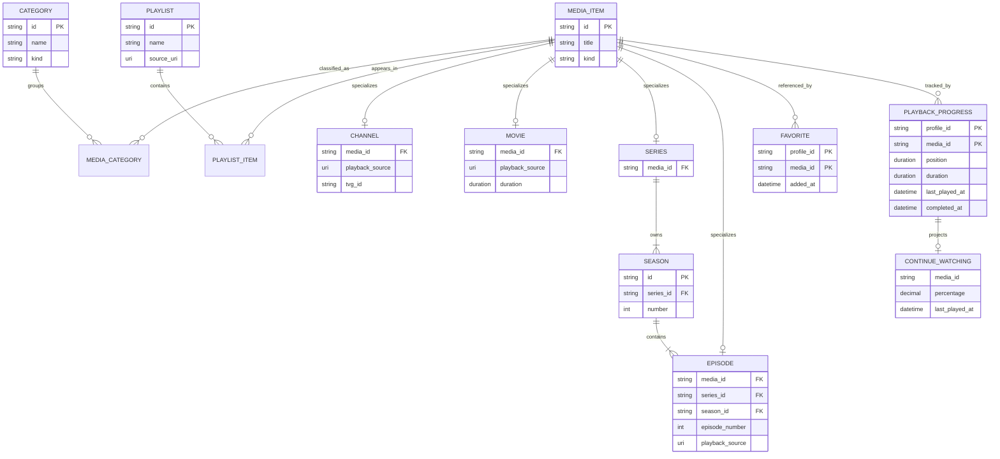
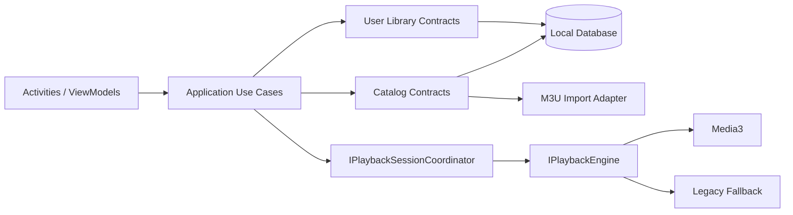

# Sprint 3 - Design Review

## 1. Status e decisao

**Status:** aprovado para implementacao.

**Gate de entrada:** a Sprint 2 foi homologada fisicamente. Os cenarios P01-P12 foram aprovados, sem crash, ANR, memory leak ou vazamento de player reportado.

**Decisao:** **GO para Sprint 3**.

Este documento e exclusivamente arquitetural. Nenhum codigo de producao e alterado por esta revisao.

## 2. Objetivo da Sprint 3

Unificar o dominio de catalogo e consumo de midia para suportar:

1. Live TV.
2. Filmes.
3. Series, temporadas e episodios.
4. Favoritos.
5. Historico de reproducao.
6. Continue Watching.

A Sprint 3 deve preservar o player homologado da Sprint 2 e consumir seus contratos existentes, sem reabrir a implementacao interna de Media3, fallback ou hardening.

## 3. Estado atual

A aplicacao Android possui uma base parcial de Clean Architecture:

- `Domain/Entities`: `MediaItem`, `Channel`, `Series` e `Episode`.
- `Domain/ValueObjects`: `MediaId`.
- `Domain/Interfaces`: `IPlaybackEngine`, `IPlaylistRepository` e `IEpgProvider`.
- `Application/UseCases`: apenas `LoadPlaylistUseCase`.
- `Infrastructure/Playlist`: parser e repositorio M3U.
- `Infrastructure/Playback`: Media3, Legacy, hardening, metricas e diagnosticos.
- `Models` e `Services`: modelos e fachadas legadas usados diretamente pela UI.

### 3.1 Pontos fortes

- O playback esta isolado por `IPlaybackEngine`.
- `MediaItem` fornece identidade comum por `MediaId`.
- Playlist M3U ja e convertida para `Channel` no dominio.
- Infraestrutura e testavel sem depender diretamente das Activities.

### 3.2 Lacunas

- `Movie`, `Season`, `Playlist`, `Category`, `Favorite`, `PlaybackProgress` e `ContinueWatching` ainda nao existem no dominio.
- `Series` contem episodios diretamente e nao representa temporadas.
- `MediaItem.Source` e obrigatorio, embora uma serie normalmente nao seja reproduzivel diretamente.
- Categorias sao strings e constantes legadas.
- Favoritos usam `SharedPreferences` sem contrato de dominio.
- Nao ha persistencia de historico ou progresso.
- `ContinueWatching` nao existe como consulta/projecao.
- Activities ainda dependem de `ChannelItem`, `MediaCategory` e servicos concretos.

## 4. Principios arquiteturais

1. **Dominio independente de plataforma:** nenhuma entidade referencia Android, Media3, SharedPreferences ou UI.
2. **Uma identidade de midia:** todos os itens usam `MediaId`; IDs devem ser estaveis entre importacoes.
3. **Separacao entre catalogo e estado do usuario:** metadados de midia nao armazenam favorito ou progresso.
4. **Repositorios por agregado:** evitar um repositorio por tabela ou por tela.
5. **Continue Watching como projecao:** deriva de `PlaybackProgress`; nao duplica estado persistido.
6. **Live e on-demand distintos:** canal ao vivo nao usa progresso posicional como filme/episodio.
7. **Compatibilidade incremental:** adaptadores legados permanecem apenas durante a migracao.
8. **Player congelado:** Sprint 3 envia `PlaybackRequest` ao contrato homologado sem alterar engines.
9. **Operacoes cancelaveis:** interfaces assincronas recebem `CancellationToken`.
10. **Persistencia substituivel:** contratos permitem armazenamento local hoje e sincronizacao futura.

## 5. Dominio unificado

### 5.1 MediaItem

Raiz abstrata dos itens de catalogo.

| Campo | Tipo conceitual | Regra |
|---|---|---|
| Id | `MediaId` | Obrigatorio, imutavel e estavel |
| Title | `string` | Obrigatorio |
| Description | `string?` | Opcional |
| ArtworkUri | `Uri?` | Opcional |
| CategoryIds | colecao de `CategoryId` | Sem duplicidade |
| Metadata | mapa chave/valor | Somente metadados externos nao normalizados |
| Kind | `MediaKind` | `Channel`, `Movie`, `Series` ou `Episode` |

`MediaItem` nao deve exigir `Source`. Apenas itens reproduziveis implementam o conceito `IPlayableMedia` ou possuem `PlaybackSource`.

### 5.2 Channel

Representa uma transmissao linear ao vivo.

| Campo | Regra |
|---|---|
| PlaybackSource | Obrigatorio |
| TvgId / TvgName | Opcionais, preservados da playlist |
| IsOnline | Estado observado, nao garantia persistida |
| Number | Opcional, para ordenacao |

Nao participa de Continue Watching posicional. Pode gerar historico de acesso com posicao nula.

### 5.3 Movie

Item on-demand reproduzivel.

| Campo | Regra |
|---|---|
| PlaybackSource | Obrigatorio |
| Duration | Opcional ate descoberta pelo player |
| ReleaseYear | Opcional |
| Rating | Opcional |

Pode possuir `Favorite`, `PlaybackProgress` e entrada em `ContinueWatching`.

### 5.4 Series

Aggregate root de conteudo seriado.

| Campo | Regra |
|---|---|
| Seasons | Ordenadas por numero |
| TotalSeasons | Derivado |
| PlaybackSource | Ausente; serie nao toca diretamente |

A serie controla a consistencia entre temporadas e episodios. Um episodio pertence a exatamente uma temporada e uma serie.

### 5.5 Season

Entidade interna do agregado `Series`.

| Campo | Regra |
|---|---|
| Id | Estavel no escopo do catalogo |
| SeriesId | Obrigatorio |
| Number | Inteiro maior que zero |
| Title | Opcional; fallback `Temporada N` |
| Episodes | Ordenados por numero |

Nao e reproduzivel nem favoritado na primeira entrega. Favorito se aplica a `Series` ou `Episode`.

### 5.6 Episode

Item reproduzivel pertencente a uma temporada.

| Campo | Regra |
|---|---|
| SeriesId | Obrigatorio |
| SeasonId | Obrigatorio |
| SeasonNumber | Maior que zero |
| EpisodeNumber | Maior que zero dentro da temporada |
| PlaybackSource | Obrigatorio |
| Duration | Opcional |

Pode possuir progresso proprio. Conclusao de episodio alimenta a selecao automatica do proximo episodio.

### 5.7 Playlist

Aggregate root de uma fonte importavel de catalogo.

| Campo | Regra |
|---|---|
| Id | Obrigatorio |
| Name | Obrigatorio |
| SourceUri | Obrigatorio para playlists remotas |
| Format | Inicialmente `M3U` |
| ItemIds | Referencias aos itens importados |
| LastSynchronizedAt | Opcional |
| IsEnabled | Controla exibicao/sincronizacao |

A playlist e fonte de ingestao, nao dona exclusiva do `MediaItem`: o mesmo item pode aparecer em mais de uma playlist.

### 5.8 Category

Taxonomia normalizada para navegacao e filtro.

| Campo | Regra |
|---|---|
| Id | Estavel e normalizado |
| Name | Obrigatorio |
| Kind | Live, Movies, Series ou Custom |
| ParentCategoryId | Opcional |
| SortOrder | Deterministico |

A relacao com `MediaItem` e muitos-para-muitos.

### 5.9 Favorite

Estado do usuario que referencia um item de midia.

| Campo | Regra |
|---|---|
| MediaId | Unico por perfil |
| AddedAt | Obrigatorio, UTC |
| ProfileId | Preparado para multiplos perfis; perfil local padrao inicialmente |

Nao copia titulo, URL ou imagem. Esses dados sao resolvidos pelo catalogo.

### 5.10 PlaybackProgress

Fonte persistida de progresso e historico.

| Campo | Regra |
|---|---|
| MediaId | Filme ou episodio; canal apenas como historico sem posicao |
| Position | Nunca negativa |
| Duration | Maior ou igual a `Position`, quando conhecida |
| LastPlayedAt | UTC |
| CompletedAt | Preenchido ao atingir regra de conclusao |
| PlayCount | Incrementado ao iniciar uma nova sessao qualificada |

Regras iniciais:

- Salvar a cada 15 segundos, ao pausar e ao sair.
- Considerar concluido em `>= 90%` ou quando restarem `<= 2 minutos`.
- Remover de Continue Watching quando concluido.
- Ignorar progresso inferior a 30 segundos para evitar ruido.

### 5.11 ContinueWatching

Read model derivado de `PlaybackProgress` e `MediaItem`.

| Campo | Origem |
|---|---|
| MediaId / Title / Artwork | Catalogo |
| Position / Duration / Percentage | PlaybackProgress |
| LastPlayedAt | PlaybackProgress |
| NextEpisodeId | Regra de Series, quando aplicavel |

Nao possui repositorio de escrita. A consulta e fornecida por `IPlaybackProgressRepository` ou por um query service dedicado.

## 6. Relacionamentos



### 6.1 Agregados e consistencia

- **CatalogItem:** `MediaItem` e suas especializacoes.
- **Series:** `Series` e raiz; `Season` e `Episode` obedecem sua estrutura editorial.
- **Playlist:** controla origem e associacoes importadas.
- **UserLibrary:** `Favorite` e `PlaybackProgress` sao estados por perfil, persistidos separadamente do catalogo.
- **ContinueWatching:** projecao eventual; nunca participa de transacao de escrita.

## 7. Casos de uso

### 7.1 Catalogo e playlists

| Caso de uso | Entrada | Saida | Regra principal |
|---|---|---|---|
| ImportPlaylist | URL/nome | Playlist + resumo | Parsear, normalizar IDs e fazer upsert atomico |
| RefreshPlaylist | PlaylistId | Delta de catalogo | Preservar favorito/progresso dos itens reconhecidos |
| ListPlaylists | Perfil local | Playlists | Somente habilitadas por padrao |
| BrowseCategory | CategoryId/filtros | Pagina de MediaItem | Ordenacao deterministica |
| GetMediaDetails | MediaId | Detalhes tipados | Resolver subtipo e relacoes |
| SearchCatalog | Texto/filtros | Pagina de MediaItem | Busca por titulo e metadados normalizados |

### 7.2 Live TV

| Caso de uso | Resultado |
|---|---|
| ListLiveChannels | Canais por categoria/favorito |
| PlayChannel | `PlaybackRequest` sem resume posicional |
| RetryChannel | Delega ao engine homologado |
| RecordChannelVisit | Historico com data e sem Continue Watching |

### 7.3 Filmes e series

| Caso de uso | Resultado |
|---|---|
| ListMovies | Filmes paginados por categoria |
| PlayMovie | Retoma progresso elegivel ou inicia do zero |
| ListSeries | Series paginadas por categoria |
| GetSeriesDetails | Temporadas e episodios ordenados |
| PlayEpisode | Retoma episodio e prepara proximo episodio |
| MarkAsCompleted | Conclui progresso e remove da projecao ativa |

### 7.4 Biblioteca do usuario

| Caso de uso | Resultado |
|---|---|
| AddFavorite | Favorite idempotente |
| RemoveFavorite | Remocao idempotente |
| ListFavorites | Itens ainda existentes no catalogo |
| SavePlaybackProgress | Upsert validado de posicao/duracao |
| GetHistory | Itens por `LastPlayedAt` descendente |
| GetContinueWatching | Filmes/episodios incompletos e elegiveis |
| ClearHistory | Remove progressos conforme escopo confirmado |

## 8. Interfaces propostas

As assinaturas abaixo sao contratos de design; nao representam codigo implementado nesta revisao.

```csharp
public interface IMediaCatalogRepository
{
    Task<MediaItem?> GetByIdAsync(MediaId id, CancellationToken ct);
    Task<PagedResult<MediaItem>> BrowseAsync(CatalogQuery query, CancellationToken ct);
    Task<PagedResult<MediaItem>> SearchAsync(SearchQuery query, CancellationToken ct);
    Task UpsertAsync(IReadOnlyCollection<MediaItem> items, CancellationToken ct);
}

public interface ISeriesRepository
{
    Task<Series?> GetWithSeasonsAsync(MediaId seriesId, CancellationToken ct);
    Task UpsertAggregateAsync(Series series, CancellationToken ct);
}

public interface IPlaylistRepository
{
    Task<PlaylistImport> LoadAsync(Uri source, CancellationToken ct);
    Task<IReadOnlyList<Playlist>> ListAsync(CancellationToken ct);
    Task SaveAsync(Playlist playlist, CancellationToken ct);
    Task SetEnabledAsync(PlaylistId id, bool enabled, CancellationToken ct);
}

public interface ICategoryRepository
{
    Task<IReadOnlyList<Category>> ListAsync(MediaKind? kind, CancellationToken ct);
    Task UpsertAsync(IReadOnlyCollection<Category> categories, CancellationToken ct);
}

public interface IFavoriteRepository
{
    Task<bool> ContainsAsync(ProfileId profileId, MediaId mediaId, CancellationToken ct);
    Task AddAsync(Favorite favorite, CancellationToken ct);
    Task RemoveAsync(ProfileId profileId, MediaId mediaId, CancellationToken ct);
    Task<PagedResult<MediaItem>> ListAsync(ProfileId profileId, PageRequest page, CancellationToken ct);
}

public interface IPlaybackProgressRepository
{
    Task<PlaybackProgress?> GetAsync(ProfileId profileId, MediaId mediaId, CancellationToken ct);
    Task SaveAsync(PlaybackProgress progress, CancellationToken ct);
    Task<PagedResult<PlaybackProgress>> GetHistoryAsync(ProfileId profileId, PageRequest page, CancellationToken ct);
    Task<PagedResult<ContinueWatching>> GetContinueWatchingAsync(ProfileId profileId, PageRequest page, CancellationToken ct);
    Task RemoveAsync(ProfileId profileId, MediaId mediaId, CancellationToken ct);
}

public interface IPlaybackSessionCoordinator
{
    Task StartAsync(MediaId mediaId, CancellationToken ct);
    Task PauseAsync(CancellationToken ct);
    Task StopAsync(CancellationToken ct);
}
```

### 8.1 Responsabilidade dos repositorios

| Repositorio | Fonte inicial | Responsabilidade |
|---|---|---|
| IMediaCatalogRepository | Banco local | Consulta e persistencia polimorfica do catalogo |
| ISeriesRepository | Banco local | Carregamento consistente do agregado de series |
| IPlaylistRepository | HTTP + banco local | Importacao e configuracao de playlists |
| ICategoryRepository | Banco local | Taxonomia e ordenacao |
| IFavoriteRepository | Banco local | Biblioteca por perfil |
| IPlaybackProgressRepository | Banco local | Progresso, historico e Continue Watching |

Evitar `IChannelRepository`, `IMovieRepository` e `IEpisodeRepository` na primeira entrega. O catalogo unificado cobre consultas comuns; `ISeriesRepository` existe porque a carga do agregado exige consistencia propria.

## 9. Estrategia por experiencia

### 9.1 Live TV

- Importar entradas lineares como `Channel`.
- Navegar por categoria, numero e favoritos.
- Iniciar sempre ao vivo, sem resume posicional.
- Registrar visita no historico, mas excluir de Continue Watching.
- Manter retries, timeout, circuit breaker e fallback da Sprint 2 sem alteracao.

### 9.2 Filmes

- Importar ou cadastrar como `Movie` com fonte reproduzivel.
- Exibir detalhes, favorito e progresso.
- Oferecer `Continuar` quando houver progresso elegivel; caso contrario, `Assistir`.
- Ao concluir, manter no historico e retirar de Continue Watching.

### 9.3 Series

- Carregar `Series` com temporadas e episodios ordenados.
- Persistir progresso por episodio, nunca apenas por serie.
- Abrir a serie no ultimo episodio incompleto ou no proximo nao assistido.
- Marcar episodio concluido pela mesma regra de filmes.
- Nao implementar autoplay do proximo episodio na primeira fatia sem nova homologacao de playback.

### 9.4 Favoritos

- Favoritar canais, filmes, series e episodios por `MediaId`.
- Operacoes idempotentes e independentes do ciclo de importacao.
- Se o item sair temporariamente do catalogo, preservar a referencia por periodo de retencao definido.
- Migrar chaves atuais de SharedPreferences por adaptador, sem expor Android ao dominio.

### 9.5 Historico

- Ordenar por `LastPlayedAt` descendente.
- Registrar sessao qualificada apos 30 segundos.
- Canal ao vivo aparece como acesso recente sem barra de progresso.
- Filme/episodio mostra posicao, duracao e conclusao.
- Permitir remocao individual; limpeza total exige confirmacao.

### 9.6 Continue Watching

- Derivar apenas filmes e episodios incompletos.
- Ordenar pelo acesso mais recente.
- Excluir itens com menos de 30 segundos, concluidos ou indisponiveis.
- Resolver metadados atuais pelo catalogo para evitar snapshots obsoletos.
- Limitar a primeira pagina para carregamento rapido na Home.

## 10. Persistencia e sincronizacao

### 10.1 Banco local

Adotar persistencia relacional local com migracoes versionadas. Tabelas conceituais:

- `MediaItems`, `Channels`, `Movies`, `Series`, `Seasons`, `Episodes`.
- `Playlists`, `PlaylistItems`.
- `Categories`, `MediaCategories`.
- `Favorites`, `PlaybackProgress`.

Indices obrigatorios:

- `MediaItems(kind, title)`.
- `PlaylistItems(playlist_id, media_id)` unico.
- `MediaCategories(category_id, media_id)`.
- `Favorites(profile_id, media_id)` unico.
- `PlaybackProgress(profile_id, last_played_at)`.
- `Episodes(series_id, season_id, episode_number)` unico.

### 10.2 Identidade e importacao

- Preferir ID externo estavel (`tvg-id` ou ID do provedor).
- Na ausencia, gerar ID deterministico a partir de fonte normalizada e tipo.
- Atualizacao de playlist usa upsert e marca ausencias; nao apaga imediatamente estado do usuario.
- URLs e credenciais nunca entram em logs ou telemetria.

### 10.3 Concorrencia

- Escritas de progresso usam last-write-wins por `UpdatedAt` na fase local.
- Atualizacao de playlist e atomica: catalogo anterior permanece disponivel se a importacao falhar.
- UI consome snapshots imutaveis e consultas paginadas.

## 11. Fluxo arquitetural alvo



A UI nao acessa banco, HTTP, SharedPreferences ou engines concretos. ViewModels dependem apenas dos casos de uso.

## 12. Plano detalhado de implementacao

### Fase 0 - Baseline e protecao

1. Criar branch da Sprint 3 a partir do commit homologado.
2. Fixar hash do APK e anexar evidencia UAT ao release.
3. Executar novamente testes e build como baseline.
4. Proibir alteracoes em `Infrastructure/Playback` sem change request e regressao P01-P12.

**Saida:** baseline reproduzivel e player protegido.

### Fase 1 - Contratos do dominio

1. Definir `MediaKind`, `PlaybackSource` e IDs tipados.
2. Ajustar o desenho de `MediaItem` para itens reproduziveis e containers.
3. Modelar `Movie`, `Season`, `Playlist`, `Category`, `Favorite` e `PlaybackProgress`.
4. Remodelar `Series` e `Episode` conforme o agregado.
5. Definir regras de conclusao e elegibilidade de Continue Watching.
6. Criar testes unitarios de invariantes antes dos adaptadores.

**Saida:** dominio compilavel, independente de Android e coberto por testes.

### Fase 2 - Persistencia e migracao

1. Selecionar biblioteca de banco local compativel com .NET Android.
2. Implementar schema e migracoes versionadas.
3. Implementar catalogo, categorias, favoritos e progresso.
4. Criar migracao idempotente dos favoritos legados.
5. Validar atomicidade, indices e comportamento offline.

**Saida:** repositorios locais funcionais e dados legados preservados.

### Fase 3 - Ingestao e catalogo

1. Evoluir parser/importador para classificar Channel, Movie, Series e Episode.
2. Normalizar categorias e IDs.
3. Implementar importacao atomica e refresh incremental.
4. Implementar Browse, Details e Search paginados.
5. Medir tempo e memoria com playlists grandes.

**Saida:** catalogo unificado navegavel sem mocks.

### Fase 4 - Biblioteca do usuario

1. Implementar Add/Remove/List Favorites.
2. Implementar gravacao periodica de progresso.
3. Implementar historico e limpeza controlada.
4. Implementar projecao Continue Watching.
5. Validar conclusao, indisponibilidade e reimportacao de itens.

**Saida:** estado do usuario persistente e consistente.

### Fase 5 - Integracao de playback

1. Criar `IPlaybackSessionCoordinator` sobre o `IPlaybackEngine` homologado.
2. Resolver `PlaybackRequest` a partir de `MediaId`.
3. Aplicar resume apenas a Movie/Episode.
4. Salvar progresso em pause, stop, erro e lifecycle.
5. Garantir que nenhuma persistencia bloqueie thread de UI ou release do player.
6. Executar regressao P01-P12.

**Saida:** catalogo e progresso integrados ao player sem regressao.

### Fase 6 - UI e navegacao

1. Introduzir ViewModels por fluxo, sem repositorio concreto na Activity.
2. Implementar Live, Movies, Series, Favorites, History e Continue Watching.
3. Preservar foco, D-pad e back stack em TV.
4. Implementar estados loading, vazio, offline e erro.
5. Validar acessibilidade, rotacao e restauracao de estado.

**Saida:** experiencia completa nos dispositivos-alvo.

### Fase 7 - QA e release

1. Testes unitarios de dominio e casos de uso.
2. Testes de integracao de repositorios e migracoes.
3. Testes de importacao com playlists pequenas, grandes e invalidas.
4. UAT funcional nos cinco perfis de dispositivo.
5. Regressao obrigatoria P01-P12.
6. Verificacao de crash, ANR, memoria e vazamento de player.
7. Parecer GO/NO GO da Sprint 3.

**Saida:** release candidate com rastreabilidade completa.

## 13. Priorizacao do backlog

### Must Have

- Dominio unificado e persistencia local.
- Live TV, Movies e Series sem mocks.
- Favoritos migrados.
- Historico e Continue Watching.
- Integracao com player homologado.
- Testes de dominio, repositorios e regressao P01-P12.

### Should Have

- Busca paginada.
- Refresh incremental de playlists.
- Limpeza individual e total do historico.
- Indicadores de progresso em listas e detalhes.

### Could Have

- Multiplos perfis.
- Sincronizacao entre Android e WebOS.
- Recomendacoes.
- Autoplay do proximo episodio.

### Fora do escopo inicial

- DRM novo.
- Download offline.
- Gravacao de Live TV.
- Mudanca nos engines homologados.
- Backend de conta/sincronizacao.

## 14. Criterios de aceite da Sprint 3

- Entidades e contratos nao dependem de Android.
- Nenhuma Activity acessa persistencia concreta diretamente nos fluxos migrados.
- Favoritos existentes sao migrados sem perda.
- Progresso sobrevive ao encerramento do processo.
- Continue Watching respeita as regras de elegibilidade e conclusao.
- Canais ao vivo nunca recebem resume posicional.
- Series mantem temporadas e episodios ordenados e consistentes.
- Importacao falha sem destruir o catalogo valido anterior.
- Consultas de Home/listas sao paginadas e nao bloqueiam a UI.
- P01-P12 permanecem aprovados apos integracao.
- Nao ha crash, ANR, memory leak ou vazamento de player.

## 15. Riscos e mitigacoes

| Risco | Impacto | Mitigacao |
|---|---|---|
| IDs instaveis recriam favoritos/progresso | Alto | Estrategia deterministica e testes de reimportacao |
| Serie sem estrutura confiavel no M3U | Alto | Classificador isolado, atributos externos e fallback controlado |
| Escrita frequente de progresso afeta I/O | Medio | Debounce de 15 s e flush em lifecycle |
| Catalogo grande bloqueia UI | Alto | Importacao transacional fora da UI, indices e paginacao |
| Migracao de SharedPreferences perde favoritos | Alto | Migracao idempotente com backup e contagem antes/depois |
| Mudanca indireta regride player | Alto | Congelamento do engine e regressao P01-P12 |
| Fire TV diverge em codecs/lifecycle | Medio | Matriz fisica dedicada em cada release candidate |

## 16. Decisoes abertas antes da implementacao

1. Escolher a biblioteca de persistencia local e sua politica de migracao.
2. Definir formato de classificacao Movie/Series quando a playlist nao fornece metadados suficientes.
3. Definir retencao de favoritos/progresso para itens ausentes da playlist.
4. Confirmar se multiplas playlists entram no MVP da Sprint 3 ou apenas no schema.
5. Confirmar politica de historico para Live TV.

Essas decisoes nao bloqueiam o **GO** da Sprint 3, mas devem ser fechadas na Fase 1 antes da implementacao dos adaptadores.

## 17. Conclusao

A arquitetura proposta separa catalogo, estado do usuario e playback, preserva o player homologado e permite entrega incremental. Com P01-P12 aprovados e sem incidentes criticos reportados, a Sprint 3 esta **DESBLOQUEADA** para iniciar pela Fase 0 e Fase 1.
